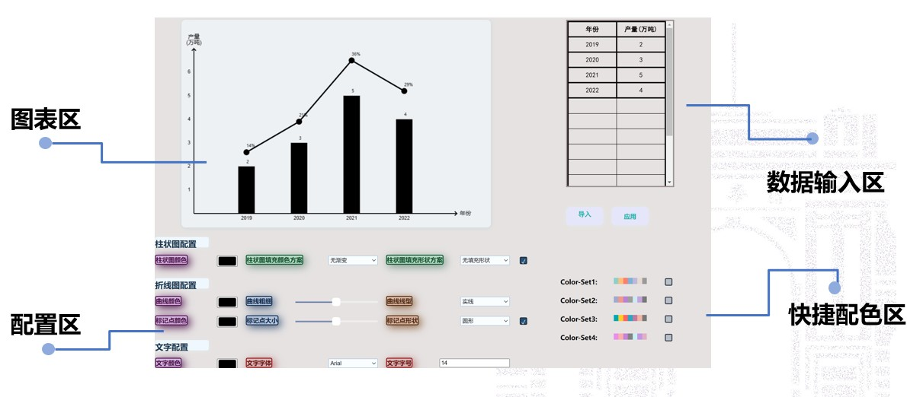
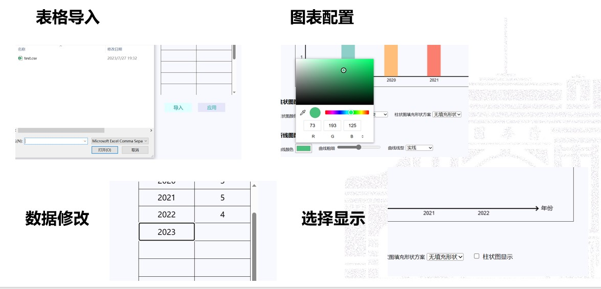

# **可交互可配置图表**

### 成员名单

* **林佳锋**  2021012537  lin-jf21@mails.tsinghua.edu.cn

* **党余凡**  2021012534  dangyf21@mails.tsinghua.edu.cn

* **朱冠儒**  2021012541  zgr21@mails.tsinghua.edu.cn

* **张一弛**  2021012532  yichi-zh21@mails.tsinghua.edu.cn

## 使用说明

### 图表绘制部分

提供了将数据绘制为图表的绘制功能以及用于修改数据的表格区功能。

- 数据由自变量数据与因变量数据组成
- 图表为1个`canvas`区域（后由组员分离为4个`canvas`区域管理）：
  - 坐标系绘制：原点、刻度及标签
  - 柱状图绘制：矩形（位置、大小依赖于数据）
  - 折线图绘制：点+线（位置依赖于数据）
- 表格区为1个数据表格与2个数据操作按钮：
  - 数据表格：可编辑数据、支持无限滚动单元格自增（设置了上限）
  - 导入按钮：将`input`类型输入框制作为仿按钮样式，支持选择`.csv`文件导入
  - 应用按钮：将表格数据应用于图表，非法数据将被忽略

### 图表配置区域

针对已经完成基础绘制的柱状图，为增加变化和美观度，设置了有关柱状图和折线图的配置区域。
其中，柱状图可调节：

* 填充颜色

* 渐变类型(四种，渐变方向不同)

* 填充样式(三种形状)

* 是否显示

折线图可调节

* 点的颜色，形状(三种)，大小

* 线的颜色，宽度，线型(一种实线+四种虚线类型)

* 是否显示

其中，所有的颜色均通过**拾色器**进行选取；点的大小和线的宽度均通过**滑动条**进行滑动调节；是否显示通过**勾选框**进行勾选；其他可选项均通过**下拉选项框**进行调节。
除此之外，为方便一键设置图标参数，特设置两种预置好的颜色set，可以一键勾选调节整体图像的所有可选参数；取消勾选则返回自行在配置区域选择的图像设置。

### 数据自适应部分

数据自适应部分，主要指图像可以根据数据数量变化、数据极值变化等合理地调节横轴与纵轴，使整个图像更加美观便于阅读。

横轴的调节包括：

* 数据点增加时，柱宽度实现**动态变窄**
* 数据点变化时，数据条居中显示

纵轴的调节包括：

* 标签的合理分布
* **极端数据**的自适应
* 最小值过大时**原点的自适应**

### 文字配置部分

提供了图表绘制时自主调节轴标题的字号、字体以及字体颜色。

- 字体支持多种中文字体的选择
- 字号部分支持逐步增加与自由输入
- 颜色部分通过colorpicker自由选择颜色

## 实现思路

### 图表绘制部分

将数据使用对象封装，图表与表格使用类封装，图表依数据绘制，表格修改数据。

- 数据对象：保存自变量、因变量
  - 自变量数组、因变量数组、变量对个数
  - 提供对最值、和的`getter`
- 图表类：使用`canvas`对画布进行操作
  - 绘图工具相关变量、图表参数相关变量（原点参数、轴线参数、刻度参数、柱状图参数、折线图参数）
  - 绘制函数：绘制样式依赖于当前图表参数相关变量值，绘制数据依赖于当前数据对象变量值
    - 坐标系绘制相关函数（绘制坐标轴、绘制刻度、绘制标签）
    - 柱状图绘制相关函数（绘制矩形、绘制标签）
    - 折线图绘制相关函数（绘制线、绘制点、绘制标签）
  - 可调用子函数（绘制文字、清除内容、计算坐标、重设刻度等）
- 表格类：对表格进行操作
  - 表格参数相关变量（行数等）
  - 表格修改函数（增加行数、添加数据、清除数据）
- 其他表格函数：初始化、响应等
  - 表格动态化（可无限滚动自增）初始化
  - 响应导入按钮，向表格导入`.csv`格式数据
  - 响应应用按钮，依表格内容修改数据，并调用重绘函数

### 图表配置区域

* 交互实现
  为保证良好的交互性，使用js监听界面活动及变化，实现通过界面交互来调节图像属性。
  如通过`function watchColorPicker(event)`函数监听拾色器颜色变化，变化后对对应部分颜色进行更新

* 其他实现细节说明
  * 渐变的设置
    为保证显示效果的多样，特设置四种渐变类型。在CSS中，渐变类型包含`linear gradients`和` radial gradient`,以及更复杂的`repeating gradient`。由于渐变是动态生成的，因此它们可以消除对传统用于实现类似效果的栅格图像文件的需求。此外，由于渐变是由浏览器生成的，因此在放大时它们看起来比栅格图像更好，并且可以动态调整大小。考虑到条形图的特点，此处我们采用`linear gradients`。
    `linear gradient`的设置受梯度线(轴)以及起始点和终结点的颜色影响。轴上的每个点都具有独立的颜色。为了构建出平滑的渐变，`linear-gradient()` 函数构建一系列垂直于渐变线的着色线，每一条着色线的颜色则取决于与之垂直相交的渐变线上的色。
    此处通过调节：**梯度线方向**:垂直、从图像的左下角到右上角；**起始点与终结点的颜色**:(一个为当前设置颜色，另一为`white`)；共组合出四种渐变类型。
  * 虚线类型的设置
    查找文档，发现Canvas 2D API 的`CanvasRenderingContext2D`接口的 `setLineDash()` 方法在填充线时使用虚线模式。它使用一组值来指定描述模式的线和间隙的交替长度。`setLineDash()`通过接收一个数组Array，来控制虚线中线和间隙的交替长度。
    此处调节`setLineDash()`接收的数组，实现了四种疏密程度不同的虚线。

### 数据自适应部分

* 整体实现思路：用户提交数据后，调用重绘图表的函数，在该函数中重新配置图表的各参数，以达到重绘的效果。

* 横轴柱宽度调节

  采用**类指数**函数的调节，超过一个阈值之后柱宽度以类指数的速度下降。通过多次测试找到对应参数。

* 纵轴上下限：根据数据特征选择不同策略；

  * 数据极值相差较大

    原点可以设置为0，需要警惕最大值百分比过大，折线图显示超出表格边框；

  * 数据极值相差较小

    原点需要设置为数据**最小值的相关值**，防止原点依然为0造成整个图像的高度过高，柱高度差距过小。并需要手动增加y轴的覆盖范围，保证数据的显示都在50%左右的y轴位置。

* 纵轴标签：保证数据标签不会过于密集，显示数量在合理范围。

### 文字配置部分

- 交互思路：为保证良好的交互性，使用javascript函数监听界面活动及变化，以保证通过界面交互实时调节文字属性。
- 其他细节：
  * 由于font格式为“size font-family”，使用Split、join、slice函数进行字符串的拆分和替换，满足单方面替换字号和字体的需求。
  * 接力式开发，由于大作业完成顺序的不同，需要进行变量风格的统一，方便进行变量的搜索、查找与替换。

## 遇到问题及解决办法
* **模块之间的封装与解耦** 
  **数据方面**：
  对于折线图、柱状图、以及坐标轴分别创建不同的canvas画布，进行封装，降低不同模块之间的耦合度，避免进行绘制或更新时互相影响。
  对于整体程序中的不同处理模块（例如数据导入部分和图像设置部分），通过不同的类进行管理，便于分别进行拓展以及实现模块之间的交互。
  对于程序中的数值设置，使用变量或者常量管理，非必要不使用硬编码；否则不利于后续的开发拓展以及debug时定位问题。
  **逻辑方面**：
  在对数据封装之上，处理逻辑之间也应当实现尽量解耦。对同一类进行处理，不同的处理阶段和处理方法应当用不同的函数去封装，命名也需简明清楚。便于修改、拓展；以及便于通过函数之间的互相调用实现代码的充分复用。 
  **前端界面方面**
  html中，秉承同样的封装解耦思想，需根据模块分区功能的不同以及布局位置的不同多次进行div的划分。便于在CSS中直接批量统一修改样式，也提高了html代码的可读性与可扩展性.
  
* **页面优化升级** 
  首先进行整体布局的协调，尽量避免使用百分比定位，以杜绝使用后出现无法适应不同电脑版面的问题。
  其次对各个控件以及标签进行升级优化，学习优秀的图表样式并加以实操。
  为保证良好的视觉体验，及时与成员交流想法，及时更新进度，不断更新迭代。

* **小组开发中如何高效协作？**

  代码规范：必要的注释、统一的命名、分离的逻辑

  成员进度追踪：两次项目会议、群聊实时汇报

* **如何应对修改优化后的突发错误？**

  向前追溯：由问题特性确定作者，交流修改上游代码

  向后预防：易发错误注释提醒，不安全函数重新封装

